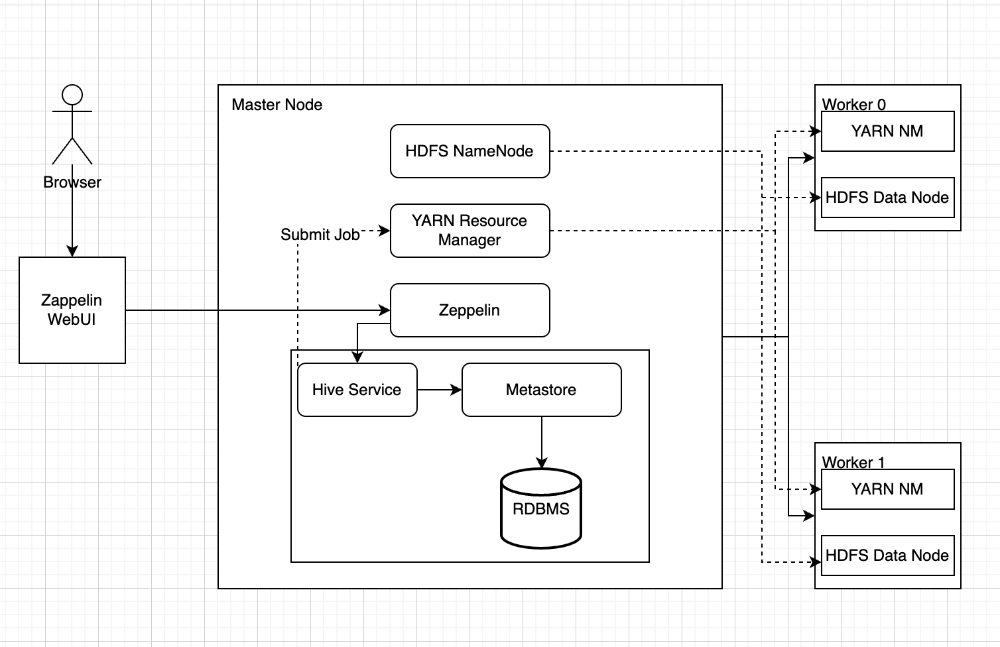

# Hadoop Project
## Introduction
### Purpose of this project
  The primary objective of this project is to explore and evaluate the capabilities of Hadoop and its ecosystem, specifically focusing on Apache Hive, in addressing and solving complex business problems. By leveraging the power of Hadoop clusters and distributed computing, we aim to efficiently process large-scale data and extract valuable insights.
  
### Learnings and Evaluations
Throughout the course of this project, we have learned and evaluated various core Hadoop components, such as MapReduce, HDFS, and YARN. We provisioned a Hadoop cluster on Google Cloud Platform (GCP) using Dataproc, which allowed us to manage and scale our resources as needed.

We utilized Apache Hive and the Zeppelin Notebook to address specific business problems, practicing various HiveQL queries and comparing the efficiency of different methodologies. Some of the techniques we used include:

- Querying with and without cache to determine performance differences
- Evaluating partitioned vs non-partitioned queries to optimize data retrieval
- Resolving parsing issues using CSV SerDe for improved data handling
- Optimizing data storage and access by implementing columnar file formats

## Hadoop Cluster
- Cluster Architecture Diagram
  
- Big Data Tools
  - Hadoop (MapReduce,YARN,HDFS)
  - Hive
  - Zeppelin
  - Spark
- Hardware Specifications
  - Our Hadoop cluster comprised one master node and two worker nodes, each equipped with 2 CPUs, 16 GB of memory, and 100 GB of primary storage. In addition, we installed the Zeppelin notebook to manage HiveQL queries, enabling us to interact with our data in an organized and efficient manner.
  
  

## Hive Project
- Optimizing Hive queries
  - Using OpenCSVSerde to resolve parsing issues: OpenCSVSerde is a custom serializer-deserializer (SerDe) for Apache Hive that helps in handling CSV data. By utilizing OpenCSVSerde, we were able to resolve parsing issues that may arise when dealing with complex CSV data, such as embedded delimiters, quotes, or escape characters.
  - Using partitioning (by year) to improve query execution time: In our project, we partitioned the data based on the year, which allowed us to execute queries faster, as only the relevant partitions were accessed instead of scanning the entire dataset.
  - Using columnar file optimization with Parquet to improve query execution time: By storing our data in a columnar format like Parquet, we were able to achieve better compression and improved query performance due to the reduced I/O operations needed to access only the required columns.
  - Comparing MapReduce execution time with Spark: We compared the execution times of MapReduce and Spark to understand their performance differences in the context of our specific use case. The results demonstrated that Spark generally outperformed MapReduce, especially when it came to iterative and complex queries.
- Zeppelin Notebook
  .png)
  .png)
    

## Improvements
1. Addressing interpreter issues: During the project, we encountered issues with the Markdown and Shell Script interpreters in Apache Zeppelin, specifically the "Interpreter process is not running" error. To resolve these issues, we can investigate the root causes, such as checking for configuration errors, ensuring the required dependencies are installed, and verifying that the interpreter settings are correctly configured.
2. Incorporating bucketing and user-defined functions: To further expand our knowledge and experience with Apache Hive, we can include practice exercises that involve bucketing and user-defined functions (UDFs). Bucketing is a technique used in Hive to improve query performance by organizing data based on a particular column, while UDFs allow users to define custom functions to process data.
3. Comparing various SerDes and binary storage formats: Our current project focused on using OpenCSVSerde for parsing CSV data. However, there are other SerDes and binary storage formats available, such as Sequence Files and Avro data files, that may offer different performance characteristics or features. 