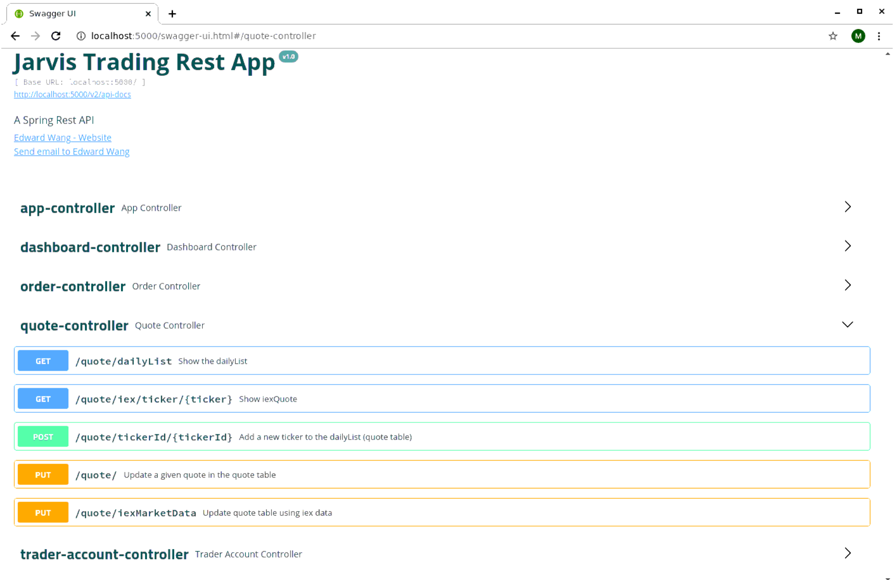
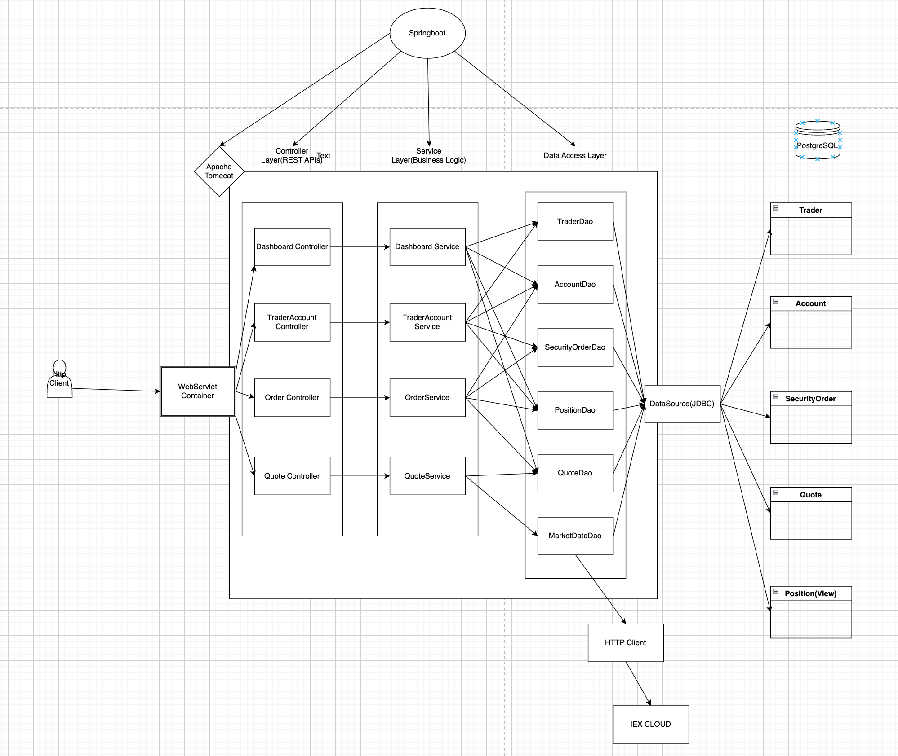
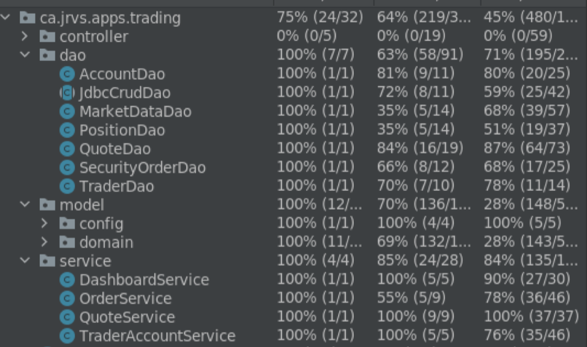
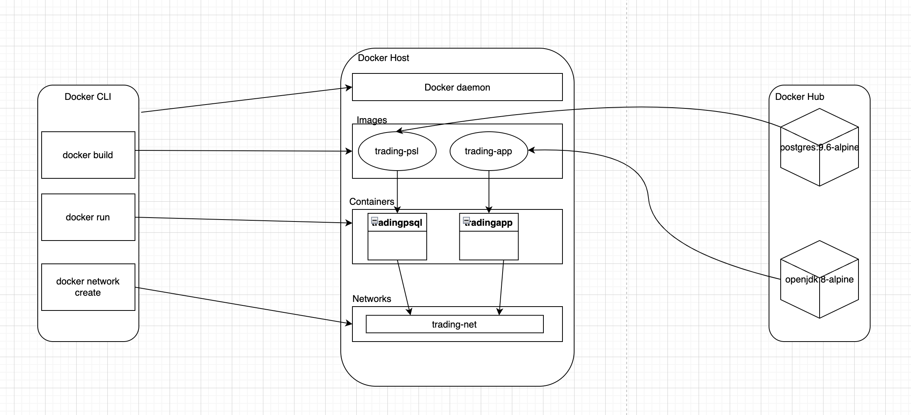

# Introduction
Jarvis's trading team is focused on developing a state-of-the-art trading platform to replace the existing legacy system, a monolithic application that has become increasingly challenging to scale and manage. Our team is tasked with creating a next-generation trading system utilizing microservice architecture and the Spring Boot framework, which will be showcased through a proof of concept.

The trading platform features a REST API that is consumed by front-end applications, providing users with the ability to efficiently manage client profiles and accounts, closely monitor portfolio performance, and execute securities trades.

We have opted to use Java 8 and Spring Boot for the implementation of the REST API, which encompasses the platform's core business logic, including managing trader profiles, executing security orders, and monitoring portfolio performance. Data persistence is ensured through the use of a PostgreSQL database. Furthermore, our Spring Boot application acquires market data from IEX Cloud, a service offering free access to market data via its REST API.
  


# Quick Start
- Docker scripts with description
  ```shell
    #Build images
    docker build -t trading-psl .
    docker image ls -f reference=trading-psl
  
    docker build -t trading-app .
    docker image ls -f reference=trading-app
  
    #Create a docker network
    sudo docker network create trading-net
    #Start Containers
    docker run --name tradingpsql -e POSTGRES_PASSWORD=password -e\ 
    POSTGRES_USER=postgres --network trading-net -d -p 5432:5432 trading-psl
  
    docker run --name tradingapp -e "PSQL_HOST=tradingpsql" -e "PSQL_PORT=5432"\ 
    -e "PSQL_DB=jrvstrading" -e "PSQL_USER=postgres" -e "PSQL_PASSWORD=password" -e\ 
    IEX_PUB_TOKEN=${IEX_PUB_TOKEN} --network trading-net -p 5000:8080 trading-app
  ```
- SwaggerUI
  

# Implementation
## Architecture
- 
- Components and Service
    - Controller layer:
      - The controller layer is responsible for handling user requests and managing the flow of data between the user and the application. It receives input from the user, processes it, and delegates tasks to the service layer. Controllers are typically responsible for mapping HTTP requests to specific methods and returning appropriate responses.
    - Service layer:
      - The service layer contains the business logic of the application. It processes data from the controller layer, performs necessary operations, and communicates with the DAO layer to interact with the data storage. This layer is responsible for coordinating different parts of the application and ensuring that the right data is passed between them.
    - DAO layer:
      - The DAO layer is responsible for managing the persistence and retrieval of data from the data storage system. It provides an abstraction layer between the application's business logic and the underlying data storage, which can be a relational database, NoSQL database, or any other storage system. This layer enables the application to switch between different storage systems without affecting the business logic.
    - SpringBoot: 
      - Spring Boot is a framework that simplifies the development, configuration, and deployment of Java applications. It includes an embedded web server (Tomcat) to handle HTTP requests and responses. Spring Boot also provides an Inversion of Control (IoC) container, which enables the application to manage dependencies efficiently by automatically injecting required objects into classes, making it easy to manage and test components.
    - PSQL and IEX:
      - PSQL (PostgreSQL) is an open-source relational database management system, used for storing and managing the application's data. In this context, it is used for caching quote data. IEX (Investors Exchange) is a stock exchange that provides market data via APIs. In this application, IEX is used as a source of real-time market data, which is fetched and processed to update the application's data.

## REST API Usage
### Swagger
  - Swagger is an open-source toolkit for designing, building, and documenting RESTful APIs, making it easier for developers to create and maintain API documentation. By using Swagger, both the API developers and consumers benefit from a clear, interactive, and well-structured API documentation, which simplifies API integration and collaboration.
### Quote Controller
- The QuoteController in this application is responsible for managing market data, which is primarily sourced from IEX through their API. To improve performance and reduce API calls, the fetched quote data is cached within a PostgreSQL database. This controller exposes various endpoints to interact with the market data, such as retrieving IEX quotes, showing the daily list of quotes, adding new tickers to the daily list, and updating quotes with the latest market data from IEX.
- Endpoints:
    - GET `/quote/dailyList`: List all tickers that are available to trading in this trading system.
    - GET `/quote/iex/ticker/{ticker}`: Fetch data from IEX API and show the iexQuote.
    - POST `/quote/tickerId/{tickerId}`: Add a new ticker which does not in the dailyList to the dailyList.
    - PUT `/quote/`: Update a given quote in the quote table.
    - PUT `/quote/iexMarketData`: Fetch quote from IEX API and update all quotes from the quote table.
### Trader Controller
- The TraderAccountController is designed to manage traders and accounts and their associated operations within the trading application. This controller exposes various endpoints to create new traders with their corresponding accounts, delete traders based on certain conditions (e.g., zero account balance and no open positions), and perform financial transactions such as depositing and withdrawing funds.
- Endpoints:
  - Post `/trader/firstname/{firstname}/lastname/{lastname}/dob/{dob}/country/{country}/email/{email`: Create a trader and an account using URL.
  - Post `/trader/`: Create a trader and an account using HTTP request body.
  - Delete `/trader/traderId/{traderId}`: Delete trader and account base on traderId after all position closed and withdraw all funds.
  - Put `/trader/deposit/traderId/{traderId}/amount/{amount}`: Deposit fund.
  - Put `/Trader/withdraw/traderId/{traderId}/amount/{amount}`: Withdraw fund.
### Order Controller
- The OrderController is designed to facilitate the submission and execution of market orders within the trading application. This controller offers an endpoint for users to submit market orders, which are then processed by the OrderService.
- Endpoints:
  - Post `/order/marketOrder`: Submit a market order.

### Dashboard controller
- The DashBoardController is designed to provide an overview of trader profiles and portfolios within the trading application. This controller exposes two endpoints that enable users to view their trader and account details, as well as their portfolio information, based on their trader ID.
- Endpoints:
  - Get `/dashboard/profile/traderId/{traderId}`: Show trader and account details.
  - Get `/dashboard/portfolio/traderId/{traderId}`: Show portfolio by trader ID.

# Test
- To ensure the reliability and accuracy of the application, testing was carried out using the JUnit 4 and Mockito testing frameworks, along with IntelliJ's built-in debug mode. The code coverage achieved through these tests was 63% for Data Access Objects (DAOs), 69% for models, and 85% for services.
- 
# Deployment

- Trading-psl: The base image for Trading-psl is postgres:9.6-alpine. And the database were initialized using initialization script provided by the base image.
- Trading-app: 
  - Build stage:
    - FROM maven:3.6-jdk-8-slim AS build: This line specifies the base image for the build stage, which is a slim version of the Maven 3.6 image with JDK 8 included.
    - COPY src /build/src: This line copies the source code from the local src directory into the /build/src directory inside the Docker image.
    - COPY pom.xml /build/: This line copies the Maven pom.xml file into the /build directory inside the Docker image.
    - RUN mvn -f /build/pom.xml clean package -DskipTests: This line runs the Maven command to clean and package the Java application, skipping tests. 
  - Package stage:
    - FROM openjdk:8-alpine: This line specifies the base image for the package stage, which is the Alpine Linux-based image with OpenJDK 8.
    - COPY --from=build /build/target/trading-1.0-SNAPSHOT.jar /usr/local/app/trading/lib/trading_app.jar: This line copies the packaged Java application (a JAR file) from the build stage image (/build/target/trading-1.0-SNAPSHOT.jar) to the package stage image (/usr/local/app/trading/lib/trading_app.jar).
    - ENTRYPOINT ["java","-jar","/usr/local/app/trading/lib/trading_app.jar"]: This line defines the entry point for the Docker container when it is run, which is to execute the java command with the -jar flag followed by the path to the JAR file.

# Improvements
If you have more time, what would you improve?
- Implement All Daos with JPA(Java Persistent API): We can make use of JPA's features to simplify the data access layer and reduce boilerplate code. JPA is a standard for object-relational mapping (ORM) in Java applications and provides a way to map Java objects to database tables, making it easier to interact with the database.
- We can enhance our application by fetching additional real-time information from IEX Cloud and storing it in PostgreSQL. This would enable us to create visualizations and diagrams in the frontend for improved user experience and data analysis.
- Implement a function to add and update all tickers from the IEX Cloud to the database. Additionally, enhance the daily list by dividing it into blocks (e.g., based on industry). This will enable more efficient organization and filtering of data, providing users with a better overview of the market and improving the overall user experience.
