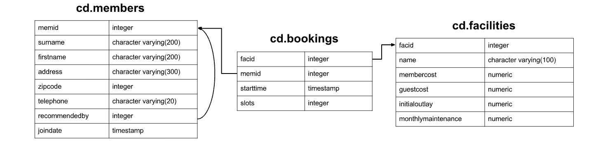

# Introduction
#### What does this project do?
In this project, we learn *SQL* and *RDBMS* by solving several SQL 
queries.
#### Who are the users?
Anyone who needs to interact with and manage data stored in 
relational databases, can use SQL to perform various operations 
such as inserting, updating, retrieving, and deleting data.
#### Technologies used?
In this project, a PostgreSQL database instance is created using 
Docker under the Jarvis remote desktop. Three tables are set up 
using DDL queries, and various SQL queries are practiced based 
on the established environment.
+ Git&Git Repository: Managed and stored the code.
+ Docker: Provision the PSQL instance.
+ JRV: Remote desktop running centos 7.
+ PostgreSQL: Practice create, read, update and delete command.

# Table Architecture
###### This is the architecture of tables.


# Load sample data into your database.
Use [clubdata.sql](./clubdata.sql) script to load sample data into your database.
```shell
psql -U <username> -f clubdata.sql -d [yourdatabase] -x -q

```

# SQL Queries
###### Table Setup (DDL)

```sql
--create schema cd
create schema if not exists cd;

create table if not exists cd.facilities
  (
     facid integer not null,
     name character varying(100) not null,
     membercost numeric not null,
     guestcost numeric not null,
     initialoutlay numeric not null,
     monthlymaintenance numeric not null,
     constraint facilities_pk primary key (facid)
   );
   
create table if not exists cd.members
  (
  	 memid integer not null,
  	 surname character varying(200),
  	 firstname character varying(200),
  	 address character varying(300),
  	 zipcode integer,
  	 telephone character varying(20),
  	 recommendedby integer,
  	 joindate timestamp,
  	 constraint members_pk primary key (memid),
  	 constraint members_recommendedby_fk foreign key (memid)
  	 references cd.members(memid) on delete set null
  );
 
create table if not exists cd.bookings
  (
     facid integer not null,
     memid integer not null,
     starttime timestamp not null,
     slots integer not null,
     constraint bookings_pk primary key (facid),
     constraint bookings_memid_fk foreign key (memid) references cd.members(memid),
     constraint booking_facid_fk foreign key (facid) references cd.facilities(facid)
)
```

###### Question 1: The club is adding a new facility - a spa. We need to add it into the facilities table. Use the following values:\facid: 9, Name: 'Spa', membercost: 20, guestcost: 30, initialoutlay: 100000, monthlymaintenance: 800.

```sql
INSERT
INTO
    CD.FACILITIES
(FACID,
 NAME,
 MEMBERCOST,
 GUESTCOST,
 INITIALOUTLAY,
 MONTHLYMAINTENANCE
)
VALUES(9,
       'SPA',
       20,
       30,
       100000,
       800);
```

###### Question 2: Automatically generate the value for the next facid, rather than specifying it as a constant.

```sql
INSERT
INTO
    CD.FACILITIES
(FACID,
 NAME,
 MEMBERCOST,
 GUESTCOST,
 INITIALOUTLAY,
 MONTHLYMAINTENANCE
)SELECT
         (
             SELECT
                 MAX(FACID)
             FROM
                 CD.FACILITIES ) + 1,
         'SPA',
         20,
         30,
         100000,
         800;
```

###### Question 3: Update the initial outlay to 10000 rather than 8000.
```sql
UPDATE
	CD.FACILITIES
SET
	INITIALOUTLAY = 10000
WHERE
	FACID = 1;
```

###### Question 4: Alter the price of the second tennis court so that it costs 10% more than the first one(without using the constant price value).
```sql
UPDATE
	CD.FACILITIES
SET
	MEMBERCOST = (
	SELECT
		MEMBERCOST
	FROM
		CD.FACILITIES
	WHERE
		FACID = 0)* 1.1,
						  GUESTCOST = (
	SELECT
		GUESTCOST
	FROM
		CD.FACILITIES
	WHERE
		FACID = 0)* 1.1
WHERE
	FACID = 1;
```

###### Question 5: Delete all bookings from the cd.bookings table.
```sql
DELETE
FROM
    CD.BOOKINGS;
```

###### Question 6: Remove member 37, who has never made a booking, from our database.
```sql
DELETE
FROM
	CD.MEMBERS
WHERE
	MEMID = 37;
```

###### Question 7: Produce a list of facilities that charge a fee to members, and that fee is less than 1/50th of the monthly maintenance cost? Return the facid, facility name, member cost, and monthly maintenance of the facilities.
```sql
SELECT
	FACID,
	NAME,
	MEMBERCOST,
	MONTHLYMAINTENANCE
FROM
	CD.FACILITIES
WHERE
	MEMBERCOST > 0
	AND MEMBERCOST < MONTHLYMAINTENANCE * 0.02;
```

###### Question 8: Produce a list of all facilities with the word 'Tennis' in their name.
```sql
SELECT
	*
FROM
	CD.FACILITIES
WHERE
	NAME LIKE '%TENNIS%';
```

###### Question 9: Retrieved the details of facilities with ID 1 and 5, do it without using the OR operator.
```sql
SELECT
	*
FROM
	CD.FACILITIES
WHERE
	FACID IN (1, 5);
```

###### Question 10: Produce a list of members who joined after the start of September 2012. Return the memid, surname, firstname, and joindate of the members in question.
```sql
SELECT
	*
FROM
	CD.MEMBERS
WHERE
	JOINDATE >= '2012-09-01';
```

###### Question 11: Combined list of all surnames and all facility names.
```sql
SELECT
	SURNAME
FROM
	CD.MEMBERS
UNION
SELECT
	NAME
FROM
	CD.FACILITIES;
```

###### Question 12: Produce a list of the start times for bookings by members named 'David Farrell'.
```sql
SELECT
	CD.BOOKINGS.STARTTIME
FROM
	CD.BOOKINGS
INNER JOIN CD.MEMBERS ON
	CD.BOOKINGS.MEMID = CD.MEMBERS.MEMID
WHERE
	CD.MEMBERS.FIRSTNAME = 'DAVID'
	AND CD.MEMBERS.SURNAME = 'FARRELL';
```

###### Question 13: Produce a list of the start times for bookings for tennis courts, for the date '2012-09-21'. Return a list of start time and facility name pairings, ordered by the time.
```sql
SELECT
	BKS.STARTTIME,
	FACS.NAME
FROM
	CD.FACILITIES FACS
INNER JOIN CD.BOOKINGS BKS ON
	FACS.FACID = BKS.FACID
WHERE
	FACS.NAME LIKE 'TENNIS COURT%'
	AND BKS.STARTTIME >= '2012-09-21'
	AND BKS.STARTTIME < '2012-09-22'
ORDER BY
	BKS.STARTTIME ;
```

###### Question 14: Output a list of all members, including the individual who recommended them (if any)? Ensure that results are ordered by (surname, firstname).
```sql
SELECT
	MEMS.FIRSTNAME ,
	MEMS.SURNAME ,
	RECS.FIRSTNAME,
	RECS.SURNAME
FROM
	CD.MEMBERS MEMS
LEFT OUTER JOIN
CD.MEMBERS RECS ON
	RECS.MEMID = MEMS.RECOMMENDEDBY
ORDER BY
	MEMS.SURNAME ,
	MEMS.FIRSTNAME;
```

###### Question 15: Output a list of all members who have recommended another member. Ensure that there are no duplicates in the list, and that results are ordered by (surname, firstname).
```sql
SELECT
	RECS.FIRSTNAME,
	RECS.SURNAME
FROM
	CD.MEMBERS MEMS
LEFT OUTER JOIN CD.MEMBERS RECS ON
	RECS.MEMID = MEMS.RECOMMENDEDBY
ORDER BY
	RECS.SURNAME,
	RECS.FIRSTNAME;
```

###### Question 16: Output a list of all members, including the individual who recommended them (if any), without using any joins. Ensure that there are no duplicates in the list, and that each firstname + surname pairing is formatted as a column and ordered.
```sql
SELECT
	DISTINCT MEMS.FIRSTNAME || ' ' || MEMS.SURNAME AS MEMBER,
	(
	SELECT
		RECS.FIRSTNAME || ' ' || RECS.SURNAME AS RECOMMENDER
	FROM
		CD.MEMBERS RECS
	WHERE
		RECS.MEMID = MEMS.RECOMMENDEDBY)
FROM
	CD.MEMBERS MEMS
ORDER BY
	MEMBER;
```

###### Question 17: Produce a count of the number of recommendations each member has made. Order by member ID.
```sql
SELECT
	CD.MEMBERS.RECOMMENDEDBY,
	COUNT(*)
FROM
	CD.MEMBERS
WHERE
	RECOMMENDEDBY IS NOT NULL
GROUP BY
	RECOMMENDEDBY
ORDER BY
	RECOMMENDEDBY;
```

###### Question 18: Produce a list of the total number of slots booked per facility. For now, just produce an output table consisting of facility id and slots, sorted by facility id.
```sql
SELECT
	FACID,
	SUM(SLOTS) AS "TOTAL SLOTS"
FROM
	CD.BOOKINGS
GROUP BY
	FACID
ORDER BY
	FACID;
```

###### Question 19: Produce a list of the total number of slots booked per facility in the month of September 2012. Produce an output table consisting of facility id and slots, sorted by the number of slots.
```sql
SELECT
	FACID,
	SUM(SLOTS) AS "TOTAL SLOTS"
FROM
	CD.BOOKINGS
WHERE
	STARTTIME >= '2012-09-01'
	AND STARTTIME < '2012-10-01'
GROUP BY
	FACID
ORDER BY
	SUM(SLOTS);
```

###### Question 20: Produce a list of the total number of slots booked per facility per month in the year of 2012. Produce an output table consisting of facility id and slots, sorted by the id and month.
```sql
SELECT
	FACID,
	EXTRACT(MONTH
FROM
	STARTTIME) AS MONTH,
	SUM(SLOTS)
FROM
	CD.BOOKINGS
WHERE
	EXTRACT(YEAR
FROM
	STARTTIME) = 2012
GROUP BY
	FACID,
	MONTH
ORDER BY
	FACID,
	MONTH;
```

###### Question 21: Find the total number of members (including guests) who have made at least one booking.
```sql
SELECT
    COUNT(DISTINCT MEMID)
FROM
    CD.BOOKINGS;
```

###### Question 22: Produce a list of each member name, id, and their first booking after September 1st 2012. Order by member ID.
```sql
SELECT
	MEMS.SURNAME AS SURNAME,
	MEMS.FIRSTNAME AS FIRSTNAME,
	MEMS.MEMID,
	MIN(BKS.STARTTIME) AS STARTTIME
FROM
	CD.MEMBERS MEMS
LEFT OUTER JOIN CD.BOOKINGS BKS ON
	MEMS.MEMID = BKS.MEMID
WHERE
	BKS.STARTTIME >= '2012-09-01'
GROUP BY
	SURNAME,
	FIRSTNAME 
,
	MEMS.MEMID
ORDER BY
	MEMS.MEMID;
```

###### Question 23: Produce a list of member names, with each row containing the total member count. Order by join date, and include guest members.
```sql
SELECT
	COUNT(*) OVER(),
	FIRSTNAME,
	SURNAME
FROM
	CD.MEMBERS
ORDER BY
	JOINDATE;
```

###### Question 24: Produce a monotonically increasing numbered list of members (including guests), ordered by their date of joining. Remember that member IDs are not guaranteed to be sequential.
```sql
SELECT
	ROW_NUMBER() OVER(
	ORDER BY JOINDATE),
	FIRSTNAME ,
	SURNAME
FROM
	CD.MEMBERS
ORDER BY
	JOINDATE;
```

###### Question 25: Produce a monotonically increasing numbered list of members (including guests), ordered by their date of joining. Remember that member IDs are not guaranteed to be sequential.
```sql
FACID,
TOTAL
FROM
(
SELECT
	FACID,
	SUM(SLOTS) TOTAL,
	RANK() OVER(
	ORDER BY SUM(SLOTS) DESC)
						 RANK
FROM
	CD.BOOKINGS
GROUP BY
	FACID) AS RANKED
WHERE
RANK = 1;
```

###### Question 26: Output the names of all members, formatted as 'Surname, Firstname'.
```sql
SELECT
	SURNAME || ', ' || FIRSTNAME AS NAME
FROM
	CD.MEMBERS;
```

###### Question 27: Find all the telephone numbers that contain parentheses, returning the member ID and telephone number sorted by member ID.
```sql
SELECT
	MEMID,
	TELEPHONE
FROM
	CD.MEMBERS
WHERE
	TELEPHONE ~ '[()]';
```

###### Question 28: Produce a count of how many members you have whose surname starts with each letter of the alphabet. Sort by the letter, and don't worry about printing out a letter if the count is 0.
```sql
SELECT
	SUBSTRING(CD.MEMBERS.SURNAME, 1, 1) AS LETTER ,
	COUNT(*) AS COUNT
FROM
	CD.MEMBERS
GROUP BY
	LETTER
ORDER BY
	LETTER;
```


